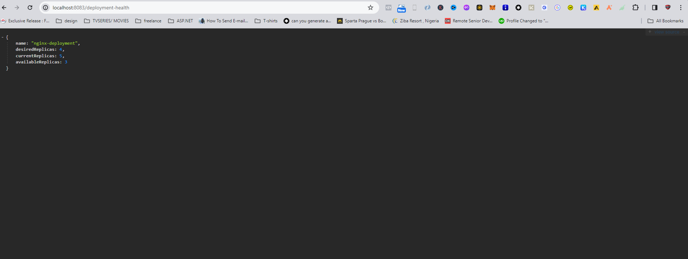
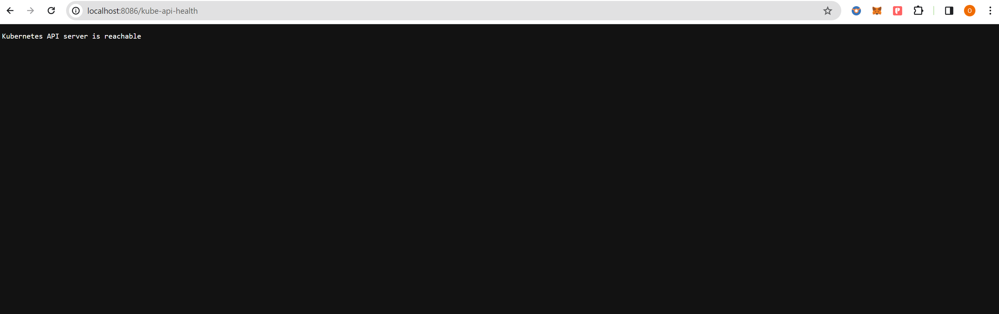

# tyk-sre-assignment

This repository contains the project for the SRE role interview assignments. There are two projects: one for Go and one for Python respectively.

### Go Project

Location: https://github.com/TykTechnologies/tyk-sre-assignment/tree/main/golang

In order to build the project run:
```
go mod tidy & go build
```

To run it against a real Kubernetes API server:
```
./tyk-sre-assignment --kubeconfig '~/.kube/config' --address ":8040" --namespace 'tom' --selector 'app=nginx2'

```

You can also run it with docker after building the image
```
docker build -t my-tyk:v1 -f dockerfile .

docker run -v ~/.kube/config:/kube/config -p 8040:8040 -e KUBECONFIG=/kube/config -e LISTEN_ADDRESS=:8040 -e NAMESPACE=tom -e SELECTOR=app=nginx2 my-tyk:v1
```

To confirm if the network policy was created;
```
kubectl get networkpolicy isolate-<NAMESPACE> -n <NAMESPACE> -o yaml
```

To Deploy the application using Helm
```
helm install tyk-project-release ./tyk-project
```

To execute unit tests:
```
go test -v
```
### ABOUT THE PROJECT

The project has 3 major functions( *CreateNetworkPolicy, CheckKubernetesAPIConnectivity, and DeploymentHealthHandler*) that solves the SRE tasks indicated in the powerpoint file.

**CreateNetworkPolicy** : This function generates network policies tailored to specific namespaces and deployment targets identified by selector labels. These policies can be applied at the namespace level to enforce network traffic restrictions for designated workloads.


**CheckKubernetesAPIConnectivity** : Utilizing the Client-go Golang package, this function verifies connectivity to the Kubernetes API server. It features an HTTP endpoint (/kube-api-health) that assesses the reachability of the API server and returns a status indicating whether the server is accessible or not.


**DeploymentHealthHandler** : Implemented with an HTTP endpoint, this function queries all deployments across various namespaces within the Kubernetes cluster. It identifies any unhealthy deployments and provides a JSON output listing the affected deployments, if any. Alternatively, if all deployments are deemed healthy, it presents a message indicating their overall health status.





### GitHUB Workflow
A GitHub Actions workflow was implemented to automate the building and pushing of the application's Docker image to Docker Hub or any specified container registry upon each commit to the master branch. The resulting Docker image, once pushed to Docker Hub, serves as the basis for deploying the application to Kubernetes using a Helm chart.


### Helm Chart

A Helm chart was developed to facilitate the deployment of the application on Kubernetes. This Helm chart integrates the Docker image stored on DockerHub by referencing it within the deployment.yaml file. Additionally, the containers within the deployment are configured with liveness and readiness probes to ensure their health and availability.


### Python Project

Location: https://github.com/TykTechnologies/tyk-sre-assignment/tree/main/python

We suggest using a Python virtual env, e.g.:
```
python3 -m venv .venv
source .venv/bin/activate
```

Make sure to install the dependencies using `pip`:
```
pip3 install -r requirements.txt
```

To run it against a real Kubernetes API server:
```
python3 main.py --kubeconfig '/path/to/your/kube/conf' --address ":8080"
```

To execute unit tests:
```
python3 tests.py -v
```
